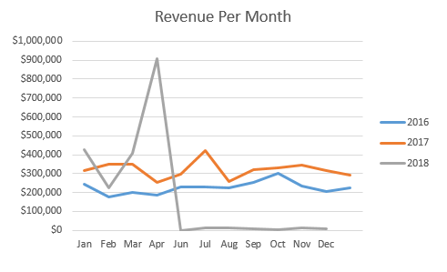
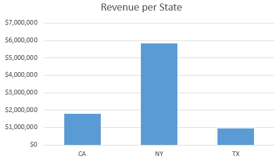
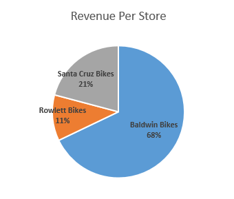
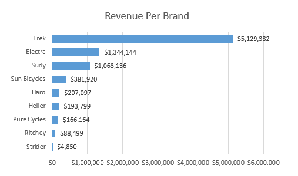
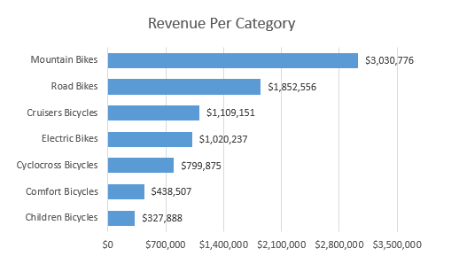
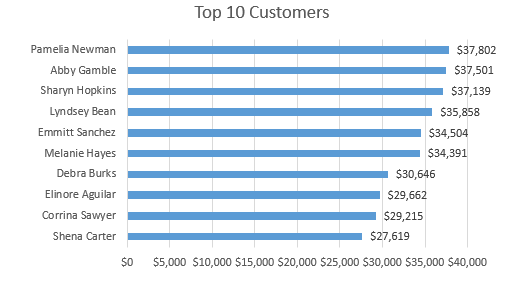
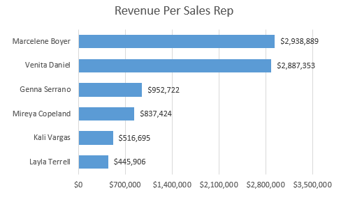

# BikeStores Database Analysis

This project demonstrates how to analyze data from the BikeStores database by creating a database view, exporting the data to Excel, and performing pivot table analysis and visualizations. The goal is to derive meaningful insights about sales performance, customer distribution, and revenue generation.

## Introduction

The **BikeStores** database is a relational database designed for managing inventory, sales, and customer data for a fictional bike store. This project involves querying the database to create a view that consolidates key sales metrics. The view is exported to Excel for further analysis using pivot tables and visualizations.

## Database Schema

The BikeStores database consists of the following tables:

1. **production.categories**: Contains product category details.
2. **production.brands**: Contains product brand details.
3. **production.products**: Stores product information including name, brand, category, and price.
4. **sales.customers**: Stores customer details including contact and address.
5. **sales.stores**: Represents store details such as name and location.
6. **sales.staffs**: Maintains information about store staff members.
7. **sales.orders**: Captures customer orders including order status and dates.
8. **sales.order_items**: Links orders to products with quantity and pricing.
9. **production.stocks**: Manages product inventory in stores.

### SQL Schema


## View Definition

The view consolidates sales data, combining customer, product, and store information with revenue calculations. It enables efficient reporting on key metrics such as total units sold and revenue generated.

### SQL Code for the View

```sql
SELECT
    ord.order_id,
    CONCAT(cus.first_name, ' ', cus.last_name) AS 'customers',
    cus.city,
    cus.state,
    ord.order_date,
    SUM(ite.quantity) AS 'total_units',
    SUM(ite.quantity * ite.list_price) AS 'revenue',
    pro.product_name,
    cat.category_name,
    sto.store_name,
    CONCAT(sta.first_name, ' ', sta.last_name) AS 'sales_rep'
FROM sales.orders ord
JOIN sales.customers cus ON ord.customer_id = cus.customer_id
JOIN sales.order_items ite ON ord.order_id = ite.order_id
JOIN production.products pro ON ite.product_id = pro.product_id
JOIN production.categories cat ON pro.category_id = cat.category_id
JOIN sales.stores sto ON ord.store_id = sto.store_id
JOIN sales.staffs sta ON ord.staff_id = sta.staff_id
GROUP BY 
    ord.order_id,
    CONCAT(cus.first_name, ' ', cus.last_name),
    cus.city,
    cus.state,
    ord.order_date,
    pro.product_name,
    cat.category_name,
    sto.store_name,
    CONCAT(sta.first_name, ' ', sta.last_name);
```

## Excel Analysis

The data retrieved from the view was exported to Excel for further analysis.

### Pivot Tables

Key pivot tables created include:

- **Revenue and Order Date (Years)**: Summarized total revenue by year.
- **Revenue and Order Date (Months)**: Revenue trends over months, separated by year.
- **Revenue and State**: Distribution of revenue across different states.
- **Revenue and Store Name**: Revenue contribution by each store.
- **Revenue and Brand Name**: Performance metrics by product brands.
- **Revenue and Category**: Sales distribution across product categories.
- **Top 10 Customers**: The highest revenue-generating customers.
- **Revenue and Sales Representative**: Performance metrics for each sales representative.

### Visualizations

The following charts were generated based on the pivot tables:

1. **Bar Chart**: Revenue by year.


2. **Line Chart**: Monthly revenue trends, with separate lines for each year.



3. **Bar Chart**: Revenue by state.



4. **Pie Chart**: Revenue distribution by store.



5. **Bar Chart**: Revenue by brand name.



6. **Bar Chart**: Revenue by category.



7. **Bar Chart**: Top 10 customers by revenue.



8. **Bar Chart**: Revenue by sales representative.



#### Slicers

Interactive slicers were added to filter data by:

- Year
- State
- Store Name

## How to Use

1. Open SQL server, create a new database and name it BikeStores
2. Select the new BikeStores database in the SQL server
3. Open the files downloaded from the link I provided 
4. Open the 'create objects' query file and then execute it in the SQL server for the BikeStores database
5. Open the 'load data' query file and then execute it in the SQL server for the BikeStores database
6. If you want to use the Excel file directly you can download it and Open it

## Technologies Used

- **SQL Server**: For database management and querying.
- **Excel**: For data analysis and visualization.

## Recources
https://drive.google.com/drive/folders/1lOKY-t0nLmwAdR8PiucSDnKysn57TVQy?usp=sharing

